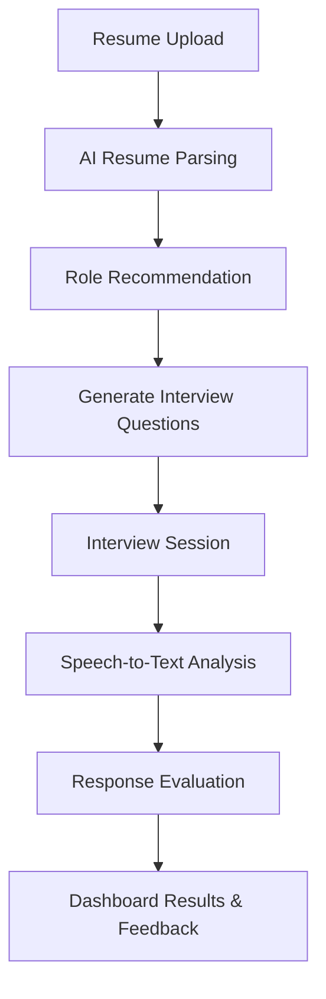

# CareerCompass 🚀

CareerCompass is an AI-powered platform that helps users analyze resumes, identify suitable job roles, generate interview questions, and assess interview responses. 
It integrates Next.js, Firebase, and AI/ML workflows to provide a seamless career guidance experience.

---

## 📌 Features

- **User Authentication** (Signup/Login with Firebase)
- **Resume Upload & Parsing** – Automatically detects skills and maps them to relevant job roles.
- **AI Role Recommendation** – Suggests suitable job positions based on resume data.
- **Interview Question Generator** – Uses LLMs to create role-specific questions.
- **Speech-to-Text Analysis** – Integrates Whisper AI to evaluate spoken responses.
- **Performance Dashboard** – Displays results, feedback, and recommendations.

---

## 🛠️ Tech Stack

- **Frontend:** Next.js + Tailwind CSS
- **Backend/Hosting:** Firebase
- **AI Services:** LLMs (for Q&A), Whisper AI (for speech analysis)
- **Database:** Firestore
- **Deployment:** Firebase Hosting

---

## ⚙️ Installation

1. Clone the repository:
   ```bash
   git clone https://github.com/your-username/CareerCompass.git
   cd CareerCompass-main
   ```

2. Install dependencies:
   ```bash
   npm install
   ```

3. Configure Firebase:
   - Create a Firebase project
   - Add `firebaseConfig` in your environment file `.env.local`

4. Run the development server:
   ```bash
   npm run dev
   ```

---

## 📂 Project Structure

```
CareerCompass-main/
│── src/
│   ├── ai/                     # AI workflows
│   │   ├── analyze-interview-responses.ts
│   │   ├── generate-interview-questions.ts
│   │   └── recommend-suitable-roles.ts
│   ├── app/                    # Next.js App Router pages
│   │   ├── (auth)/             # Authentication pages
│   │   ├── dashboard/          # User dashboard
│   │   └── layout.tsx          # Global layout
│   └── components/             # UI components
│── docs/blueprint.md           # Project blueprint
│── README.md                   # Basic README
│── DETAILED_README.md          # This file
```

---

## 🔄 System Flow



---

## 🚀 Future Improvements

- Add **multi-language support**
- Improve **AI role-matching accuracy**
- Introduce **real-time mock interviews** with avatars
- Expand **analytics dashboard** for detailed feedback

---

## 👨‍💻 Contributors

- Your Name (Project Lead)
- Open to Contributions – Feel free to fork & PR!

---

## 📜 License

MIT License © 2025 CareerCompass
